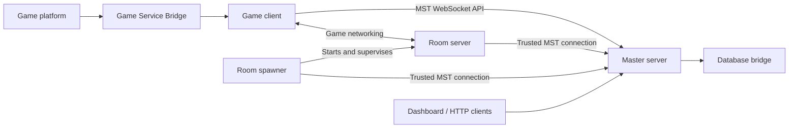

# Master Server Toolkit 5

Master Server Toolkit (MST) is a modular Unity framework for building and operating multiplayer
game backends. It provides the shared infrastructure for master servers, authenticated clients,
dedicated rooms, process spawners, persistent profiles, lobbies, chat, matchmaking, analytics,
leaderboards, platform services, and administration tools.

MST is infrastructure, not a complete game server. Game rules, combat, movement, economy policy,
and networked gameplay remain in the integrating project and its chosen networking framework.

> **Project status:** MST5 is under active development. The repository currently targets
> **Unity 2022.3.62f3**. Client, master, room, and spawner builds should use the same MST revision
> because network and persistence contracts may differ from MST4.

## Architecture



- **Master server** owns accounts, sessions, profiles, service discovery, rooms, lobbies,
  matchmaking, permissions, and shared backend modules.
- **Room server** owns the live game session and synchronizes authoritative profile changes with
  the master.
- **Spawner** starts and supervises room processes on demand.
- **Client** uses the MST socket API for backend operations and a game networking framework for
  moment-to-moment gameplay.
- **Game Service Bridge** provides one contract for platform identity, storage, ads, purchases,
  analytics, sharing, and platform leaderboards.

## Included Systems

| Area | Current capabilities |
| --- | --- |
| Authentication | Account registration, login, guest and token sessions, password reset, email confirmation, platform bindings, duplicate-session control, and account blocking |
| Profiles | Observable profile properties, master/client/room synchronization, queued persistence, and explicit save confirmation for critical operations |
| Rooms and spawners | Room registration, access tokens, public listings, process allocation, startup, shutdown, watchdogs, and capacity control |
| Lobbies and matchmaking | Lobby factories, teams, ready state, lobby chat, room spawning, public game and region queries |
| Social | Chat channels, direct messages, membership, permissions, invitations, bans, notifications, and groups |
| Game services | Achievements, quests, analytics, censoring, remote configuration, and server-authoritative leaderboards |
| Administration | Built-in HTTP server, dashboard controllers, structured module details, logging, SMTP, and command terminal tools |
| Security | WSS support, permission challenge/proof flow, authenticated request envelopes, persistent key rings, password hashing, and replay protection |

## Integrations

### Game networking

- Mirror
- FishNet
- The MST networking API can also be used independently for backend messages.

### Databases

- LiteDB
- MongoDB
- SQL providers through SqlSugar

Database bridge assemblies are opt-in and excluded from WebGL. Register only the accessor factories
required by the active master-server scene.

### Game platforms

- Editor test service
- Desktop and generic Web fallback services
- Yandex Games
- VK Games
- VK Play
- Itch.io

Feature availability is reported per service. Unsupported platform features become ready with
`IsSupported = false`, allowing the game UI to hide them without platform-specific checks.

## Requirements

- Unity **2022.3.62f3**
- Git LFS
- A supported desktop build target for master, room, and spawner processes
- WebGL is supported for clients; server-only database assemblies are excluded from WebGL

The standalone repository already contains the framework, demos, bridge code, and Unity project
settings used for MST5 development. It is not currently distributed as a Unity Package Manager
package.

## Quick Start

1. Install Git LFS before cloning:

   ```bash
   git lfs install
   ```

2. Clone the repository:

   ```bash
   git clone https://github.com/aevien/master-server-toolkit.git
   ```

3. Open the cloned folder in Unity `2022.3.62f3` and allow the initial import to finish.

4. Build the smallest connection example from:

   `Tools > Master Server Toolkit > Build > Demos > Basic Connection > All`

5. Start `Builds/BasicConnection/MasterServer/MasterServer.exe`, then start
   `Builds/BasicConnection/Client/Client.exe`.

The builder writes matching `application.cfg` files for the master and client. Use the
authentication, profiles, chat, rooms, and worlds demos after the basic socket connection has been
verified.

## Configuration

MST reads `application.cfg` from the project or build root by default. A different main file can be
selected with `-mstConfigFile`. Configuration files can import reusable defaults:

```ini
@import "Configs/common.cfg"
@import "Configs/security.cfg"

-mstStartMaster=true
-mstMasterIp=127.0.0.1
-mstMasterPort=25200
```

Resolution priority is:

1. Environment variable
2. Command-line argument
3. Main configuration file
4. Imported configuration defaults

The main file wins over imported values. Repeated imports are ignored to prevent cycles, missing
imports produce a warning, and the first imported duplicate wins. Canonical argument names and
examples are defined in
[`MstArgNames.cs`](Assets/MasterServerToolkit/MasterServer/Scripts/Mst/MstArgNames.cs).

Do not commit a generated production key ring and then deploy the same private keys to unrelated
projects. Configure a stable `-mstSecurityKeyRingFile` path for each production environment and use
WSS or external TLS termination for public connections.

## Documentation

Start with the area that owns the behavior you want to change:

- [Framework map](Assets/MasterServerToolkit/README.md)
- [Master server and runtime](Assets/MasterServerToolkit/MasterServer/README.md)
- [Built-in server modules](Assets/MasterServerToolkit/MasterServer/Scripts/Modules/README.md)
- [Networking](Assets/MasterServerToolkit/Networking/README.md)
- [Game Service Bridge](Assets/MasterServerToolkit/GameServiceBridge/README.md)
- [Database and networking bridges](Assets/MasterServerToolkit/Bridges/README.md)
- [Demos](Assets/MasterServerToolkit/Demos/README.md)
- [Authentication client/server guide](Assets/MasterServerToolkit/docs/authentication-client-server.md)
- [Test suite](Assets/MasterServerToolkit.Tests/README.md)

Most modules have a README beside their implementation. Those local documents define ownership,
runtime flow, configuration, extension points, and failure behavior for the current code.

## Testing

Open `Window > General > Test Runner`, select **EditMode**, and run the
`MasterServerToolkit.Tests.EditMode` assembly.

The test reporter writes the latest results to:

- `Logs/MstTests/latest.txt`
- `Logs/MstTests/latest.xml`

The EditMode suite covers core module contracts, lifecycle behavior, concurrency, authentication,
permissions, profiles, rooms, spawners, WebSocket failure handling, persistence adapters, and
platform validation. Real transport, room-process, database, and WebGL platform flows still require
focused integration tests.

## Development Rules

- Keep MST independent from any specific game's gameplay types and policies.
- Keep platform-specific behavior inside `GameServiceBridge`.
- Keep database-provider behavior inside `Bridges/<Provider>`.
- Use `MstArgNames`, `Mst.Args`, `MstOpCodes`, `MstProperties`, and MST logging instead of parallel
  project-specific infrastructure.
- Preserve packet serialization order and server authority checks.
- Account for every Unity Enter Play Mode configuration, including disabled Domain Reload and
  disabled Scene Reload.
- Add or update the nearest README whenever behavior or designer-facing configuration changes.

Detailed maintenance constraints are documented in
[`Assets/MasterServerToolkit/AGENTS.md`](Assets/MasterServerToolkit/AGENTS.md).

## License

Master Server Toolkit is available under the [MIT License](LICENSE).
